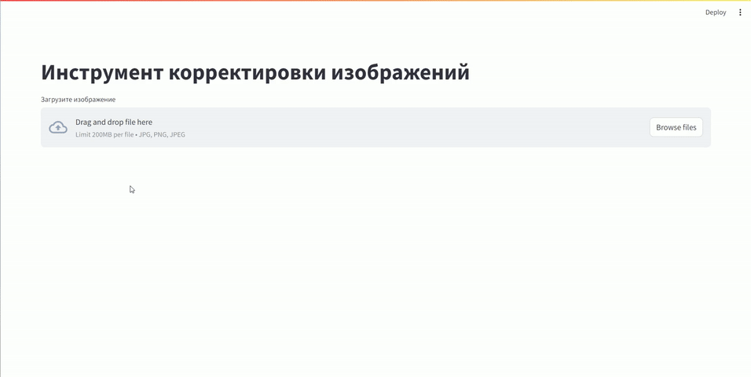

# Репозиторий для обучения нейросетевых моделей по семантической сегментации + пример использования моделей на примере веб-приложения 

Ноутбук для обучения сети Unet - [__baseline-train.ipynb__](https://nbviewer.org/github/Koldim2001/Unet-pytorch-training/blob/main/baseline-train.ipynb) \
Код написан под формат данных CamVid из CVAT

Код веб-сервиса по изменению цвета волос и кожи, основанный на работе нейронной сети из примера - __web.py__. В примере рассматривается сеть, которая сегментирует кожу и волосы на фотографиях. 
Cсылка на сайт - [веб-приложение](https://image-editor-unet-pytorch.streamlit.app/)



camvid-dataset из видео (трехклассовая сегментация) доступен по этой ссылке - [DATASET](https://drive.google.com/file/d/1Vezw0oGxn8eUMMiH7StNgA1EtYfLev0l/view?usp=sharing)


## __УСТАНОВКА:__
Необходимо иметь установленный python 3 любой версии. \
Данные команды требуется запускать последовательно в терминале:
1. Склонируйте к себе этот репозиторий 
2. Перейдите с помощью команды cd в созданную папку 
3. Загрузите все необходимые библиотеки: 

PS: Лучше torch ставить сразу с поддержкой gpu __если она имеется__: 
```
pip install torch torchvision torchaudio --index-url https://download.pytorch.org/whl/cu121
```
либо если нет cuda:
```
pip install torch torchvision
```
далее запустить надо:
```
pip install -r requirements.txt
```
---

После этого можно работать с ноубуком обучения.\
Но если есть желание запустить локально веб-сайт, то необходимо в терминате запустить эту команду:
```
streamlit run web.py
```


---

## Webinar/Tutorial
Имеется подробный туториал по работе с данным репозиторием, в котором рассказаны основные теоретические и практические моменты по обучению моделей семантической сегментации + использования моделей на практике\
YouTube видео доступно по [__ССЫЛКЕ__](https://www.youtube.com/watch?v=zpyzBR3MuT0)


